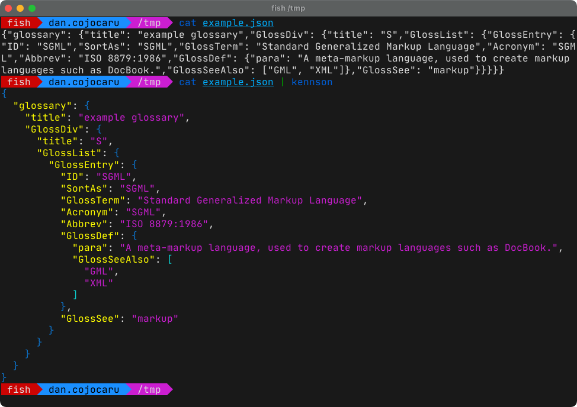

# kennson

A terminal utility to pretty print JSON.



## Build instructions

Make sure you have [Dart](https://dart.dev/get-dart) installed, then run the following:

```bash
dart compile exe bin/kennson.dart
```

The compiled executable will be inside the `bin` folder, named `kennson.exe` (regardless of platform).

## Parameters

```text
-f, --file=<filename>               Read JSON from file instead of stdin
    --input=<json input>            Read JSON as parameter instead of stdin
    --jsonpath=<JSONPath query>     Display only the matches of the JSON document (also --path)
-p, --jsonpointer=<JSON Pointer>    Display only the matches of the JSON pointer (also --pointer)
-i, --indent                        Set space indentation level (prefix with t for tab indentation)
                                    (defaults to "2")
-d, --max-depth                     Specify maximum nesting before stopping printing
```
